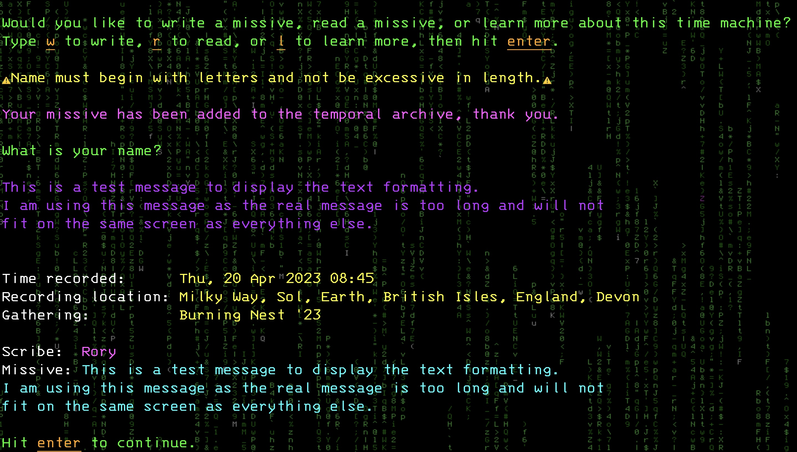
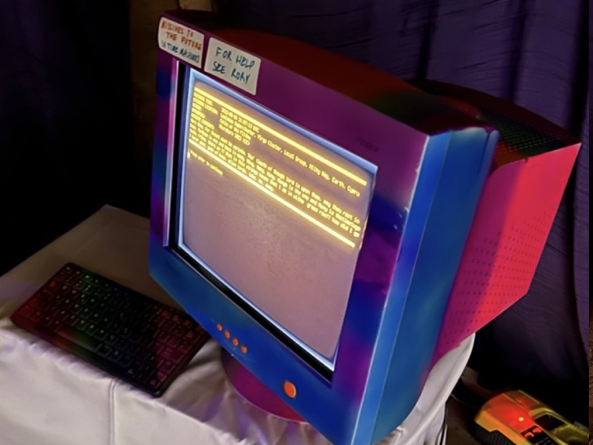
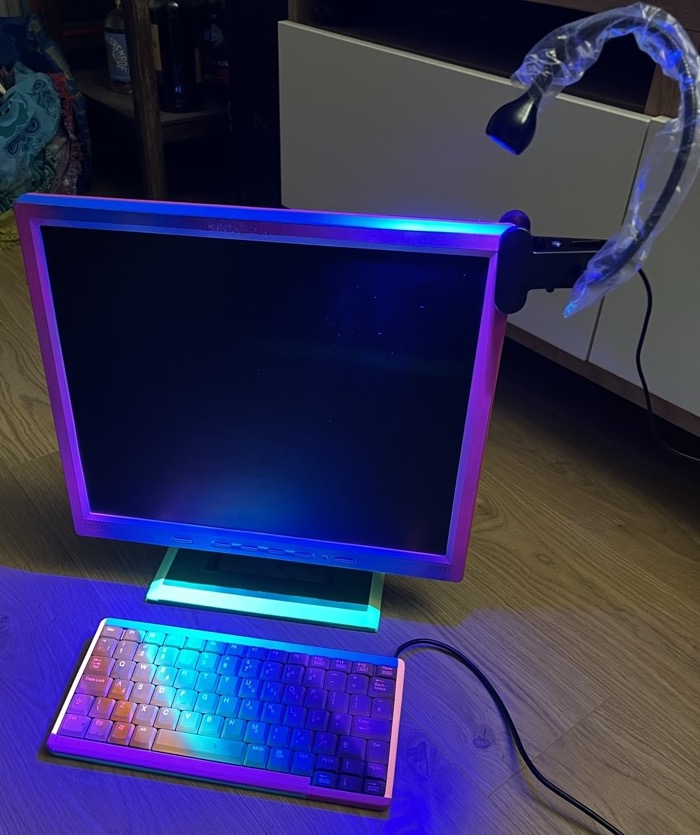

# Missives to the Future
#### A time machine that allows you to send messages to people in the future.

### About
This is an art project that I created to share with my friends.

It is a CLI app, and is essentially a guest book that lets you leave a message that can be read back by other users.

It can be run on a laptop, but I prefer to run it on a raspberry pi with a retro monitor (see pics below).

Seeing the way people engage with it, and watching the message archive grow over time, has been a real joy.

### Usage

If you already have python and know how to use pip:

Run `python main.py` to start the program.

If you've never used python:

You can check if you have python already installed by opening a terminal window and entering `python --version`. If you see something like `Python 3.11.3` then you have it installed. If you see an error then follow the instructions on [this page](https://realpython.com/installing-python/) to install python.

Next install the project dependencies. Do this by running `pip install -r requirements.txt` in the missives project folder.

Now run `python main.py` to start the program.

### Database

I used sqlite for this project. The database will be created automatically as a `.db` file in the project root directory. Remember to back this file up.

### Gallery

If you want to play around with the colours use the test card to get quick feedback on what the colour changes look like. It displays all of the different text outputs from the program.

Make your changes in `styles.py`. The test card is located in the project root, and can be run with `python test_card.py`.

I used [rich](https://github.com/textualize/rich/blob/master/README.md) to format the fonts.

In this screenshot I've used iterm2 to set the background to be a matrix style picture.

I initially used a CRT monitor to display it on. I combined it with [cool-retro-term](https://github.com/Swordfish90/cool-retro-term) for some great visual effects:

A second monitor I used is an old LCD monitor, with UV paint and tape and a UV light attached:

